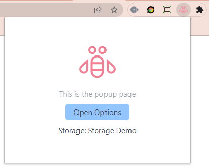
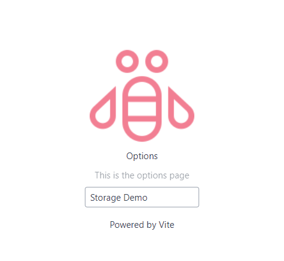
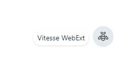

# chrome-extension-vite-vue-starter-template

This template should help get you started developing chrome extension manifest v.3 with Vue 3 in Vite. It will inject
vue component in shadow-dom, keeping the extension completely isolated so the css libs does not collide with the main app.

## Recommended IDE Setup

[VSCode](https://code.visualstudio.com/) + [Volar](https://marketplace.visualstudio.com/items?itemName=Vue.volar) (and disable Vetur) + [TypeScript Vue Plugin (Volar)](https://marketplace.visualstudio.com/items?itemName=Vue.vscode-typescript-vue-plugin).

## Features
The project was generated via `npm init vue@3` for typescript and then added
- 🍀 [Crxjs](https://github.com/crxjs/chrome-extension-tools_) - modern developer experience to the Chrome Extension ecosystem
- 🛵 [Webext Bridge](https://github.com/zikaari/webext-bridge) - Messaging in WebExtension made super easy. Out of the box.
- 🍃 [Windi CSS](https://windicss.org/) - on-demand CSS utilities
- 📦 [Components auto importing](./src/components)
- 🌟 [Icons](./src/components) - Access to icons from any iconset directly

## Extension

### Popup

### Options

### Content Script
Inject into bottom-right of the page  

